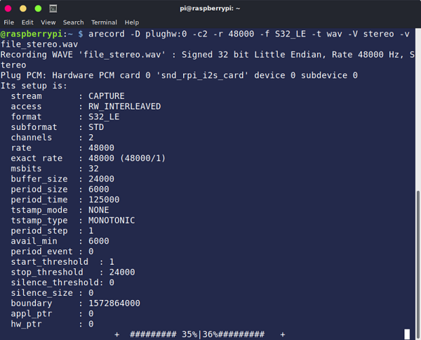
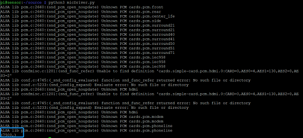
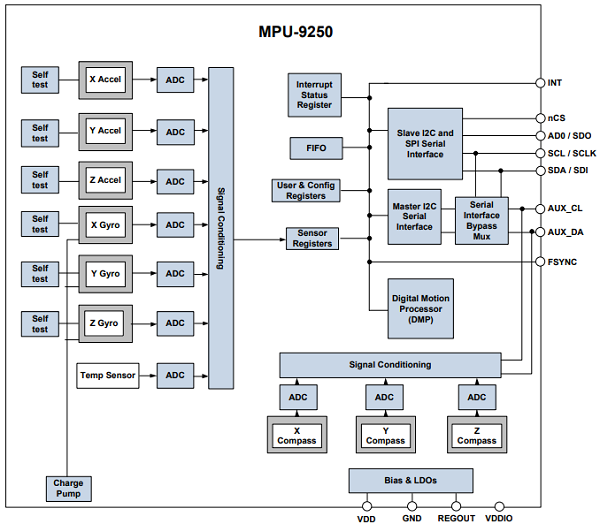
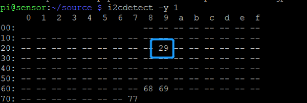
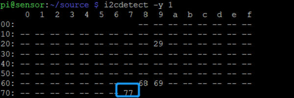
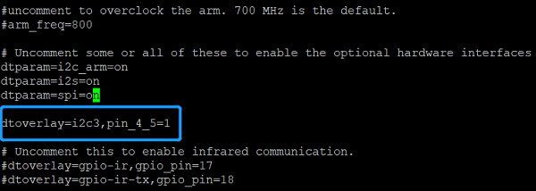
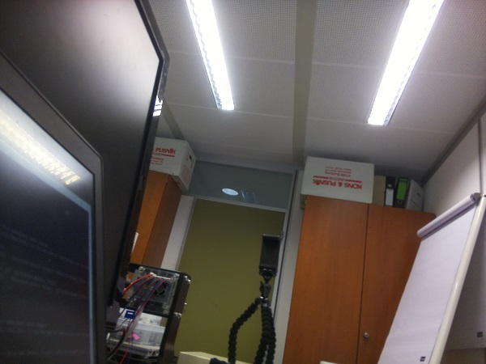

# **SENSOR EDGE**
**Editor:** Bohao Chu, **Date:** 20.09.2022, **Email:** bohao.chu@qq.com

**Supervisor:**  Fuyin Wei, Fei Xiang, Bernd Noche

We need to do some initialization before runing our embedded program and machine learning model.

## **BASIC ENVIRONMENT**
We recommend to install the following softwares before starting this section.

[Advance IP Scanner](https://download.radmin.com/download/files/Radmin_3.5.2.1_EN.zip) for getting the IP of ECSK.

[PUTTY](https://the.earth.li/~sgtatham/putty/latest/w64/putty-64bit-0.77-installer.msi) for connecting the ECSK via SSH. 

We recommend that the following two commands before executing any installation to ensure proper installation of the latest software.

- `sudo apt update`

- `sudo apt upgrade`

Install some common software. Some software requires your confirmation, so type Y when prompted.

- `sudo apt install git vim i2c-tools python3-pip portaudio19-dev libsndfile1`

Download source code.

- `git clone --branch edge https://github.com/chubohao/edge-computing-sensor-kit.git ./edge`

Install some python libraries.
- `sudo pip3 install smbus sparkfun-qwiic serial pyaudio matplotlib librosa tflite-runtime`

### **A. Sensors Driver**
<table border="1" style="text-align: center;">
    <tr>
        <td><b>Module</b></td>
        <td><b>Model</b></td> 
        <td><b>Protocol</b></td>
        <td><b>Frequency</b></td> 
        <td><b>Channel</b></td>
        <td><b>Description</b></td>
    </tr>
    <tr>
        <td><a href="https://coral.ai/products/accelerator-module">Coral</a></td>
        <td>G313</td> 
        <td>USB3.0</td> 
        <td>4TOPS</td>
        <td>1</td>
        <td>The Accelerator Module is a surface-mounted module that includes the Edge TPU and its own power control. It provides accelerated inferencing for TensorFlow Lite models on your custom PCB hardware.</td>
    </tr>
    <tr>
        <td>CM4</td>
        <td>ARM</td> 
        <td>/</td> 
        <td>Foo</td>
        <td>Foo</td>
        <td>/</td>
    </tr>
    <tr>
        <td>Microphone</td>
        <td><a href="https://learn.adafruit.com/adafruit-i2s-mems-microphone-breakout/raspberry-pi-wiring-test">INMP441</a></td> 
        <td>I2S</td> 
        <td>15K</td>
        <td>1</td>
        <td>1</td>
    </tr>
    <tr>
        <td>Motion Processing Unit</td>
        <td><a href="https://invensense.tdk.com/products/motion-tracking/9-axis/mpu-9250/">MPU9250</a></td> 
        <td>I2C</td> 
        <td>1K</td>
        <td>3</td>
        <td>The MPU-9250 is the company’s second generation 9-axis Motion Processing Unit™ for smartphones, tablets, wearable sensors, and other consumer markets.</td>
    </tr>
    <tr>
        <td>Laser</td>
        <td><a href="https://www.sparkfun.com/products/14722">VL53L1X</a></td> 
        <td>I2C</td> 
        <td>20</td>
        <td>1</td>
        <td>The MPU-9250 is the company’s second generation 9-axis Motion Processing Unit™ for smartphones, tablets, wearable sensors, and other consumer markets.</td>
    </tr>
    <tr>
        <td>EYE</td>
        <td><a href="https://www.sparkfun.com/products/14607">AMG8833</a></td> 
        <td>I2C</td> 
        <td>20</td>
        <td>1</td>
        <td>The MPU-9250 is the company’s second generation 9-axis Motion Processing Unit™ for smartphones, tablets, wearable sensors, and other consumer markets.</td>
    </tr>
    <tr>
        <td>BME</td>
        <td><a href="https://www.raspberrypi-spy.co.uk/2016/07/using-bme280-i2c-temperature-pressure-sensor-in-python/">BME280</a></td> 
        <td>I2C</td> 
        <td>20</td>
        <td>1</td>
        <td>The MPU-9250 is the company’s second generation 9-axis Motion Processing Unit™ for smartphones, tablets, wearable sensors, and other consumer markets.</td>
    </tr>
    <tr>
        <td>Color</td>
        <td><a href="https://www.sparkfun.com/products/12829">ISL29125</a></td> 
        <td>I2C</td> 
        <td>20</td>
        <td>1</td>
        <td>The MPU-9250 is the company’s second generation 9-axis Motion Processing Unit™ for smartphones, tablets, wearable sensors, and other consumer markets.</td>
    </tr>
    <tr>
        <td>ADC</td>
        <td><a href="https://www.sparkfun.com/products/15334">ADS1015</a></td> 
        <td>ADC</td> 
        <td>3.3K</td>
        <td>1</td>
        <td>The MPU-9250 is the company’s second generation 9-axis Motion Processing Unit™ for smartphones, tablets, wearable sensors, and other consumer markets.</td>
    </tr>
    <tr>
        <td>PIR</td>
        <td><a href="https://eu.mouser.com/ProductDetail/Panasonic-Industrial-Devices/AMN21111?qs=mTeSeKeuVA47b9orPGfrSw%3D%3D">AMN2111J</a></td> 
        <td>ADC</td> 
        <td>3.3K</td>
        <td>1</td>
        <td>The MPU-9250 is the company’s second generation 9-axis Motion Processing Unit™ for smartphones, tablets, wearable sensors, and other consumer markets.</td>
    </tr>
    <tr>
        <td>EMI</td>
        <td><a href="https://www.mouser.de/ProductDetail/Bourns/RLB0913-104K?qs=Rodu%2FvDoGwLymOumQmWR1A%3D%3D&mgh=1&vip=1&gclid=CjwKCAjwvsqZBhAlEiwAqAHElV2dEPjAkC9ngPHqMGE1YfzbLPp8Bsx_6S_zXgeyLb4fCHtJOefOBRoCmfkQAvD_BwE">100MH</a></td> 
        <td>ADC</td> 
        <td>3.3K</td>
        <td>1</td>
        <td>The MPU-9250 is the company’s second generation 9-axis Motion Processing Unit™ for smartphones, tablets, wearable sensors, and other consumer markets.</td>
    </tr>
    <tr>
        <td>Camera</td>
        <td><a href="https://www.raspberrypi.com/products/camera-module-v2/">IMX219</a></td> 
        <td>CSI</td> 
        <td>80</td>
        <td>1</td>
        <td>The MPU-9250 is the company’s second generation 9-axis Motion Processing Unit™ for smartphones, tablets, wearable sensors, and other consumer markets.</td>
    </tr>
</table>

#### **A1. Microphone Driver**
**First**, open I2S interface of CM4.
1. `sudo vim /boot/config.txt`
2. Find `#dtpara=i2s=on` and remove # from it, and save it. [*Before you execute this command, you must know how to use VIM to edit the file.*]

**Second**, install INMP441 Driver, execute the following commands sequentially in Terminal.
1. `sudo pip3 install --upgrade adafruit-python-shell`
2. `sudo python3 ~/edge/tools/i2smic.py`
3. Please type y when prompt `"Auto load module at boot"?`
4. Please type y when prompt `"REBOOT NOW? [Y/n]"`
5. Connect it again via ssh.

**Third**, Test the INMP441 Driver.
1. `arecord -l`
- 

2. `arecord -D plughw:0 -c1 -r 48000 -f S32_LE -t wav -V mono -v file.wav`
- 

3. `rm file.wav`

4. `python3 ~/edge/source/drivers/micDriver.py`
- 

#### **A2. Motion Processing Unit**

**First**, Open I2C1 interface of CM4.
1. `sudo raspi-config`
2. Select `3 Interface Options` and type *Enter* key.
3. Select `I5 I2C` and type *Enter* key.
4. Select `YES` via *Tab* Key
5. Select `Finish` via *Tab* Key
3. `sudo reboot` and then connect it again via ssh.

**Second**, Check the status of i2c1 and the device mount on it.

1. `i2cdetect -l` to show all i2c interfaces.

- 

2. `i2cdetect -y 1` the show all device mount on i2c1 interface, the **0x68** is the address of MPU9250.

- 

**Third**, test the driver of MPU9250.

1. `python3 ~/edge/source/drivers/mpuDriver.py`
- 

[Not work for Magnetometer](https://github.com/kriswiner/MPU9250/issues/123)

#### **A3. Laser Distance**
**First**, Open I2C1 interface of CM4.

It has been opened in the above, no need to open it again. If there is no i2c-1, please operate again.

`i2cdetect -l` to show all i2c interfaces.

- 

**Second**, Check the status of i2c1 and the device mount on it.
1. `i2cdetect -y 1` the show all device mount on i2c1 interface, the **0x29** is the address of VL53L1X.

- 

**Third**, test the driver of VL53L1X.

1. `python3 ~/edge/source/drivers/laserDriver.py`

- 

#### **A4. EYE**
**First**, Open I2C1 interface of CM4.

It has been opened in the above, no need to open it again. If there is no i2c-1, please operate again.

1. `i2cdetect -l` to show all i2c interfaces.`
- 

2. `i2cdetect -y 1` the show all device mount on i2c1 interface, the **0x69** is the address of AMG8833.
- 

**Second**, test the driver of AMG8833.

1. `python3 ~/edge/source/drivers/eyeDriver.py`
- 

#### **A5. BME**
**First**, Open I2C1 interface of CM4.

It has been opened in the above, no need to open it again. If there is no i2c-1, please operate again.

1. `i2cdetect -l` to show all i2c interfaces.`
- 

2. `i2cdetect -y 1` the show all device mount on i2c1 interface, the **0x77** is the address of BME280.
- 

**Second**, test the driver of BME280.

1. `python3 ~/edge/source/drivers/bmeDriver.py`
- 

#### **A6. Color**

**First**, Open I2C3 interface of CM4.
1. `sudo vim /boot/config.txt`
2. add `dtoverlay=i2c3,pin_4_5=1` below *# uncommet some or all of these to enable the opetional optional hardware interfaces*.
- 
3. save it and execut the command `sudo reboot` to reboot the ECSK.

**Second**, Check the status of i2c3 and the device mount on it.

1. `i2cdetect -l` to show all i2c interfaces.

- 

2. `i2cdetect -y 3` the show all device mount on i2c3 interface, the **0x44** is the address of ISL29125.

- 

**Third**, test the driver of ISL29125.

1. `python3 ~/edge/source/drivers/islDriver.py`
- 

#### **A7. ADC**
**First**, Open I2C3 interface of CM4.

It has been opened in the above, no need to open it again. If there is no i2c-3, please operate again.

1. `i2cdetect -l` to show all i2c interfaces.`
- 

2. `i2cdetect -y 3` the show all device mount on i2c1 interface, the **0x48** is the address of ADC.
- 

**Second**, Check the status of i2c3 and the device which mounted on it.

*Actually, we added two sensors AMN21111 and 100H Inductors on ADC, but we did not use them in this version. We will extent them in next version.*

#### **A8. Camera**
**First**, Open CSI1 interface of CM4.

1. `sudo vim /boot/config.txt`
2. add `dtoverlay=imx219,cam1` below *# Automatically load overlays for detected cameras*.
- 
3. save it and execut the command `sudo reboot` to reboot the ECSK.

**Second**, Check the status of CSI1.
1. `i2cdetect -l`
- 

2. `libcamera-hello --list`
- 

**Third**, make a picture.
1. `libcamera-jpeg -o test.jpg`
- 
- 

*You can use SFTP software to download the picture from ECCSK, e.g. [FileZilla](https://filezilla-project.org/), the SFTP Port is 22. You can also use other software, e.g. [Pycharm](https://www.jetbrains.com/pycharm/). Here we do not intruduce how to use SFTP, please Google it yourself.*

## **SAMPLING**
